# Projects and dependencies analysis

This document provides a comprehensive overview of the projects and their dependencies in the context of upgrading to .NETCoreApp,Version=v10.0.

## Table of Contents

- [Executive Summary](#executive-Summary)
  - [Highlevel Metrics](#highlevel-metrics)
  - [Projects Compatibility](#projects-compatibility)
  - [Package Compatibility](#package-compatibility)
  - [API Compatibility](#api-compatibility)
- [Aggregate NuGet packages details](#aggregate-nuget-packages-details)
- [Top API Migration Challenges](#top-api-migration-challenges)
  - [Technologies and Features](#technologies-and-features)
  - [Most Frequent API Issues](#most-frequent-api-issues)
- [Projects Relationship Graph](#projects-relationship-graph)
- [Project Details](#project-details)

  - [src\RevolutionaryStuff.ApiCore\RevolutionaryStuff.ApiCore.csproj](#srcrevolutionarystuffapicorerevolutionarystuffapicorecsproj)
  - [src\RevolutionaryStuff.AspNetCore\RevolutionaryStuff.AspNetCore.csproj](#srcrevolutionarystuffaspnetcorerevolutionarystuffaspnetcorecsproj)
  - [src\RevolutionaryStuff.Azure\RevolutionaryStuff.Azure.csproj](#srcrevolutionarystuffazurerevolutionarystuffazurecsproj)
  - [src\revolutionarystuff.com\revolutionarystuff.com.csproj](#srcrevolutionarystuffcomrevolutionarystuffcomcsproj)
  - [src\RevolutionaryStuff.Core\RevolutionaryStuff.Core.csproj](#srcrevolutionarystuffcorerevolutionarystuffcorecsproj)
  - [src\RevolutionaryStuff.Crm.MondayCom\RevolutionaryStuff.Crm.MondayCom.csproj](#srcrevolutionarystuffcrmmondaycomrevolutionarystuffcrmmondaycomcsproj)
  - [src\RevolutionaryStuff.Crm.OpenPhone\RevolutionaryStuff.Crm.OpenPhone.csproj](#srcrevolutionarystuffcrmopenphonerevolutionarystuffcrmopenphonecsproj)
  - [src\RevolutionaryStuff.Crm\RevolutionaryStuff.Crm.csproj](#srcrevolutionarystuffcrmrevolutionarystuffcrmcsproj)
  - [src\RevolutionaryStuff.Dapr\RevolutionaryStuff.Dapr.csproj](#srcrevolutionarystuffdaprrevolutionarystuffdaprcsproj)
  - [src\RevolutionaryStuff.Data.Cosmos\RevolutionaryStuff.Data.Cosmos.csproj](#srcrevolutionarystuffdatacosmosrevolutionarystuffdatacosmoscsproj)
  - [src\RevolutionaryStuff.Data.JsonStore.Cosmos\RevolutionaryStuff.Data.JsonStore.Cosmos.csproj](#srcrevolutionarystuffdatajsonstorecosmosrevolutionarystuffdatajsonstorecosmoscsproj)
  - [src\RevolutionaryStuff.Data.JsonStore\RevolutionaryStuff.Data.JsonStore.csproj](#srcrevolutionarystuffdatajsonstorerevolutionarystuffdatajsonstorecsproj)
  - [src\RevolutionaryStuff.Data.SqlAzure\RevolutionaryStuff.Data.SqlAzure.csproj](#srcrevolutionarystuffdatasqlazurerevolutionarystuffdatasqlazurecsproj)
  - [src\RevolutionaryStuff.SqlServer\RevolutionaryStuff.Data.SqlServer.csproj](#srcrevolutionarystuffsqlserverrevolutionarystuffdatasqlservercsproj)
  - [src\RevolutionaryStuff.Storage.Providers.Azure.Blob\RevolutionaryStuff.Storage.Providers.Azure.Blob.csproj](#srcrevolutionarystuffstorageprovidersazureblobrevolutionarystuffstorageprovidersazureblobcsproj)
  - [src\RevolutionaryStuff.Storage.Providers.LocalFileSystem\RevolutionaryStuff.Storage.Providers.LocalFileSystem.csproj](#srcrevolutionarystuffstorageproviderslocalfilesystemrevolutionarystuffstorageproviderslocalfilesystemcsproj)
  - [src\RevolutionaryStuff.Storage\RevolutionaryStuff.Storage.csproj](#srcrevolutionarystuffstoragerevolutionarystuffstoragecsproj)
  - [tests\RevolutionaryStuff.Core.Tests\RevolutionaryStuff.Core.Tests.csproj](#testsrevolutionarystuffcoretestsrevolutionarystuffcoretestscsproj)

## Executive Summary

### Highlevel Metrics

| Metric | Count | Status |
| :--- | :---: | :--- |
| Total Projects | 18 | All require upgrade |
| Total NuGet Packages | 34 | 14 need upgrade |
| Total Code Files | 447 |  |
| Total Code Files with Incidents | 63 |  |
| Total Lines of Code | 53937 |  |
| Total Number of Issues | 254 |  |
| Estimated LOC to modify | 221+ | at least 0.4% of codebase |

### Projects Compatibility

| Project | Target Framework | Difficulty | Package Issues | API Issues | Est. LOC Impact | Description |
| :--- | :---: | :---: | :---: | :---: | :---: | :--- |
| [src\RevolutionaryStuff.ApiCore\RevolutionaryStuff.ApiCore.csproj](#srcrevolutionarystuffapicorerevolutionarystuffapicorecsproj) | net9.0 | 🟢 Low | 6 | 3 | 3+ | ClassLibrary, Sdk Style = True |
| [src\RevolutionaryStuff.AspNetCore\RevolutionaryStuff.AspNetCore.csproj](#srcrevolutionarystuffaspnetcorerevolutionarystuffaspnetcorecsproj) | net9.0 | 🟢 Low | 1 | 0 |  | ClassLibrary, Sdk Style = True |
| [src\RevolutionaryStuff.Azure\RevolutionaryStuff.Azure.csproj](#srcrevolutionarystuffazurerevolutionarystuffazurecsproj) | net9.0 | 🟢 Low | 0 | 18 | 18+ | ClassLibrary, Sdk Style = True |
| [src\revolutionarystuff.com\revolutionarystuff.com.csproj](#srcrevolutionarystuffcomrevolutionarystuffcomcsproj) | net9.0 | 🟢 Low | 0 | 1 | 1+ | AspNetCore, Sdk Style = True |
| [src\RevolutionaryStuff.Core\RevolutionaryStuff.Core.csproj](#srcrevolutionarystuffcorerevolutionarystuffcorecsproj) | net9.0 | 🟢 Low | 7 | 84 | 84+ | ClassLibrary, Sdk Style = True |
| [src\RevolutionaryStuff.Crm.MondayCom\RevolutionaryStuff.Crm.MondayCom.csproj](#srcrevolutionarystuffcrmmondaycomrevolutionarystuffcrmmondaycomcsproj) | net9.0 | 🟢 Low | 0 | 8 | 8+ | ClassLibrary, Sdk Style = True |
| [src\RevolutionaryStuff.Crm.OpenPhone\RevolutionaryStuff.Crm.OpenPhone.csproj](#srcrevolutionarystuffcrmopenphonerevolutionarystuffcrmopenphonecsproj) | net9.0 | 🟢 Low | 0 | 27 | 27+ | ClassLibrary, Sdk Style = True |
| [src\RevolutionaryStuff.Crm\RevolutionaryStuff.Crm.csproj](#srcrevolutionarystuffcrmrevolutionarystuffcrmcsproj) | net9.0 | 🟢 Low | 0 | 0 |  | ClassLibrary, Sdk Style = True |
| [src\RevolutionaryStuff.Dapr\RevolutionaryStuff.Dapr.csproj](#srcrevolutionarystuffdaprrevolutionarystuffdaprcsproj) | net9.0 | 🟢 Low | 0 | 0 |  | ClassLibrary, Sdk Style = True |
| [src\RevolutionaryStuff.Data.Cosmos\RevolutionaryStuff.Data.Cosmos.csproj](#srcrevolutionarystuffdatacosmosrevolutionarystuffdatacosmoscsproj) | net9.0 | 🟢 Low | 0 | 3 | 3+ | ClassLibrary, Sdk Style = True |
| [src\RevolutionaryStuff.Data.JsonStore.Cosmos\RevolutionaryStuff.Data.JsonStore.Cosmos.csproj](#srcrevolutionarystuffdatajsonstorecosmosrevolutionarystuffdatajsonstorecosmoscsproj) | net9.0 | 🟢 Low | 0 | 1 | 1+ | ClassLibrary, Sdk Style = True |
| [src\RevolutionaryStuff.Data.JsonStore\RevolutionaryStuff.Data.JsonStore.csproj](#srcrevolutionarystuffdatajsonstorerevolutionarystuffdatajsonstorecsproj) | net9.0 | 🟢 Low | 0 | 8 | 8+ | ClassLibrary, Sdk Style = True |
| [src\RevolutionaryStuff.Data.SqlAzure\RevolutionaryStuff.Data.SqlAzure.csproj](#srcrevolutionarystuffdatasqlazurerevolutionarystuffdatasqlazurecsproj) | net9.0 | 🟢 Low | 1 | 0 |  | ClassLibrary, Sdk Style = True |
| [src\RevolutionaryStuff.SqlServer\RevolutionaryStuff.Data.SqlServer.csproj](#srcrevolutionarystuffsqlserverrevolutionarystuffdatasqlservercsproj) | net9.0 | 🟢 Low | 0 | 0 |  | ClassLibrary, Sdk Style = True |
| [src\RevolutionaryStuff.Storage.Providers.Azure.Blob\RevolutionaryStuff.Storage.Providers.Azure.Blob.csproj](#srcrevolutionarystuffstorageprovidersazureblobrevolutionarystuffstorageprovidersazureblobcsproj) | net9.0 | 🟢 Low | 0 | 46 | 46+ | ClassLibrary, Sdk Style = True |
| [src\RevolutionaryStuff.Storage.Providers.LocalFileSystem\RevolutionaryStuff.Storage.Providers.LocalFileSystem.csproj](#srcrevolutionarystuffstorageproviderslocalfilesystemrevolutionarystuffstorageproviderslocalfilesystemcsproj) | net9.0 | 🟢 Low | 0 | 2 | 2+ | ClassLibrary, Sdk Style = True |
| [src\RevolutionaryStuff.Storage\RevolutionaryStuff.Storage.csproj](#srcrevolutionarystuffstoragerevolutionarystuffstoragecsproj) | net9.0 | 🟢 Low | 0 | 1 | 1+ | ClassLibrary, Sdk Style = True |
| [tests\RevolutionaryStuff.Core.Tests\RevolutionaryStuff.Core.Tests.csproj](#testsrevolutionarystuffcoretestsrevolutionarystuffcoretestscsproj) | net9.0 | 🟢 Low | 0 | 19 | 19+ | DotNetCoreApp, Sdk Style = True |

### Package Compatibility

| Status | Count | Percentage |
| :--- | :---: | :---: |
| ✅ Compatible | 20 | 58.8% |
| ⚠️ Incompatible | 0 | 0.0% |
| 🔄 Upgrade Recommended | 14 | 41.2% |
| ***Total NuGet Packages*** | ***34*** | ***100%*** |

### API Compatibility

| Category | Count | Impact |
| :--- | :---: | :--- |
| 🔴 Binary Incompatible | 0 | High - Require code changes |
| 🟡 Source Incompatible | 71 | Medium - Needs re-compilation and potential conflicting API error fixing |
| 🔵 Behavioral change | 150 | Low - Behavioral changes that may require testing at runtime |
| ✅ Compatible | 51439 |  |
| ***Total APIs Analyzed*** | ***51660*** |  |

## Aggregate NuGet packages details

| Package | Current Version | Suggested Version | Projects | Description |
| :--- | :---: | :---: | :--- | :--- |
| Azure.Identity | 1.17.1 |  | [RevolutionaryStuff.Azure.csproj](#srcrevolutionarystuffazurerevolutionarystuffazurecsproj) [RevolutionaryStuff.Data.Cosmos.csproj](#srcrevolutionarystuffdatacosmosrevolutionarystuffdatacosmoscsproj) | ✅Compatible |
| Azure.Messaging.ServiceBus | 7.20.1 |  | [RevolutionaryStuff.Azure.csproj](#srcrevolutionarystuffazurerevolutionarystuffazurecsproj) | ✅Compatible |
| Azure.Security.KeyVault.Keys | 4.8.0 |  | [RevolutionaryStuff.Data.Cosmos.csproj](#srcrevolutionarystuffdatacosmosrevolutionarystuffdatacosmoscsproj) | ✅Compatible |
| Azure.Security.KeyVault.Secrets | 4.8.0 |  | [RevolutionaryStuff.Azure.csproj](#srcrevolutionarystuffazurerevolutionarystuffazurecsproj) | ✅Compatible |
| Azure.Storage.Files.DataLake | 12.24.0 |  | [RevolutionaryStuff.Storage.Providers.Azure.Blob.csproj](#srcrevolutionarystuffstorageprovidersazureblobrevolutionarystuffstorageprovidersazureblobcsproj) | ✅Compatible |
| Dapr.AspNetCore | 1.16.1 |  | [RevolutionaryStuff.Dapr.csproj](#srcrevolutionarystuffdaprrevolutionarystuffdaprcsproj) | ✅Compatible |
| DotNet.Glob | 3.1.3 |  | [RevolutionaryStuff.Storage.csproj](#srcrevolutionarystuffstoragerevolutionarystuffstoragecsproj) | ✅Compatible |
| Microsoft.AspNetCore.OpenApi | 9.0.9 | 10.0.2 | [RevolutionaryStuff.ApiCore.csproj](#srcrevolutionarystuffapicorerevolutionarystuffapicorecsproj) [RevolutionaryStuff.AspNetCore.csproj](#srcrevolutionarystuffaspnetcorerevolutionarystuffaspnetcorecsproj) | NuGet package upgrade is recommended |
| Microsoft.Azure.Cosmos | 3.56.0 |  | [RevolutionaryStuff.Data.Cosmos.csproj](#srcrevolutionarystuffdatacosmosrevolutionarystuffdatacosmoscsproj) | ✅Compatible |
| Microsoft.Data.SqlClient | 6.1.3 |  | [RevolutionaryStuff.Data.SqlServer.csproj](#srcrevolutionarystuffsqlserverrevolutionarystuffdatasqlservercsproj) | ✅Compatible |
| Microsoft.EntityFrameworkCore.SqlServer | 9.0.9 | 10.0.2 | [RevolutionaryStuff.Data.SqlAzure.csproj](#srcrevolutionarystuffdatasqlazurerevolutionarystuffdatasqlazurecsproj) | NuGet package upgrade is recommended |
| Microsoft.Extensions.Configuration.EnvironmentVariables | 9.0.9 | 10.0.2 | [RevolutionaryStuff.Core.csproj](#srcrevolutionarystuffcorerevolutionarystuffcorecsproj) | NuGet package upgrade is recommended |
| Microsoft.Extensions.Configuration.Json | 9.0.9 | 10.0.2 | [RevolutionaryStuff.Core.csproj](#srcrevolutionarystuffcorerevolutionarystuffcorecsproj) | NuGet package upgrade is recommended |
| Microsoft.Extensions.Configuration.UserSecrets | 9.0.9 | 10.0.2 | [RevolutionaryStuff.Core.csproj](#srcrevolutionarystuffcorerevolutionarystuffcorecsproj) | NuGet package upgrade is recommended |
| Microsoft.Extensions.Hosting | 9.0.9 | 10.0.2 | [RevolutionaryStuff.ApiCore.csproj](#srcrevolutionarystuffapicorerevolutionarystuffapicorecsproj) | NuGet package upgrade is recommended |
| Microsoft.Extensions.Hosting.Abstractions | 9.0.9 | 10.0.2 | [RevolutionaryStuff.Core.csproj](#srcrevolutionarystuffcorerevolutionarystuffcorecsproj) | NuGet package upgrade is recommended |
| Microsoft.Extensions.Http | 9.0.9 | 10.0.2 | [RevolutionaryStuff.Core.csproj](#srcrevolutionarystuffcorerevolutionarystuffcorecsproj) | NuGet package upgrade is recommended |
| Microsoft.Extensions.Http.Resilience | 9.9.0 | 10.2.0 | [RevolutionaryStuff.ApiCore.csproj](#srcrevolutionarystuffapicorerevolutionarystuffapicorecsproj) | NuGet package upgrade is recommended |
| Microsoft.Extensions.Logging.Console | 9.0.9 | 10.0.2 | [RevolutionaryStuff.Core.csproj](#srcrevolutionarystuffcorerevolutionarystuffcorecsproj) | NuGet package upgrade is recommended |
| Microsoft.Extensions.ServiceDiscovery | 9.4.2 | 10.2.0 | [RevolutionaryStuff.ApiCore.csproj](#srcrevolutionarystuffapicorerevolutionarystuffapicorecsproj) | NuGet package upgrade is recommended |
| Microsoft.NET.Test.Sdk | 18.0.1 |  | [RevolutionaryStuff.Core.Tests.csproj](#testsrevolutionarystuffcoretestsrevolutionarystuffcoretestscsproj) | ✅Compatible |
| MSTest.TestAdapter | 4.0.2 |  | [RevolutionaryStuff.Core.Tests.csproj](#testsrevolutionarystuffcoretestsrevolutionarystuffcoretestscsproj) | ✅Compatible |
| MSTest.TestFramework | 4.0.2 |  | [RevolutionaryStuff.Core.Tests.csproj](#testsrevolutionarystuffcoretestsrevolutionarystuffcoretestscsproj) | ✅Compatible |
| NCrontab | 3.4.0 |  | [RevolutionaryStuff.ApiCore.csproj](#srcrevolutionarystuffapicorerevolutionarystuffapicorecsproj) | ✅Compatible |
| OpenTelemetry.Exporter.OpenTelemetryProtocol | 1.12.0 |  | [RevolutionaryStuff.ApiCore.csproj](#srcrevolutionarystuffapicorerevolutionarystuffapicorecsproj) | ✅Compatible |
| OpenTelemetry.Extensions.Hosting | 1.12.0 |  | [RevolutionaryStuff.ApiCore.csproj](#srcrevolutionarystuffapicorerevolutionarystuffapicorecsproj) | ✅Compatible |
| OpenTelemetry.Instrumentation.AspNetCore | 1.12.0 | 1.15.0 | [RevolutionaryStuff.ApiCore.csproj](#srcrevolutionarystuffapicorerevolutionarystuffapicorecsproj) | NuGet package upgrade is recommended |
| OpenTelemetry.Instrumentation.Http | 1.12.0 | 1.15.0 | [RevolutionaryStuff.ApiCore.csproj](#srcrevolutionarystuffapicorerevolutionarystuffapicorecsproj) | NuGet package upgrade is recommended |
| OpenTelemetry.Instrumentation.Runtime | 1.12.0 |  | [RevolutionaryStuff.ApiCore.csproj](#srcrevolutionarystuffapicorerevolutionarystuffapicorecsproj) | ✅Compatible |
| Polly | 8.6.5 |  | [RevolutionaryStuff.Data.JsonStore.Cosmos.csproj](#srcrevolutionarystuffdatajsonstorecosmosrevolutionarystuffdatajsonstorecosmoscsproj) | ✅Compatible |
| Polly.Contrib.WaitAndRetry | 1.1.1 |  | [RevolutionaryStuff.Data.JsonStore.Cosmos.csproj](#srcrevolutionarystuffdatajsonstorecosmosrevolutionarystuffdatajsonstorecosmoscsproj) | ✅Compatible |
| Refit | 9.0.2 |  | [RevolutionaryStuff.Crm.OpenPhone.csproj](#srcrevolutionarystuffcrmopenphonerevolutionarystuffcrmopenphonecsproj) [RevolutionaryStuff.Dapr.csproj](#srcrevolutionarystuffdaprrevolutionarystuffdaprcsproj) | ✅Compatible |
| Refit.HttpClientFactory | 9.0.2 |  | [RevolutionaryStuff.Crm.OpenPhone.csproj](#srcrevolutionarystuffcrmopenphonerevolutionarystuffcrmopenphonecsproj) [RevolutionaryStuff.Dapr.csproj](#srcrevolutionarystuffdaprrevolutionarystuffdaprcsproj) | ✅Compatible |
| System.IO.Hashing | 9.0.11 | 10.0.2 | [RevolutionaryStuff.Core.csproj](#srcrevolutionarystuffcorerevolutionarystuffcorecsproj) | NuGet package upgrade is recommended |

## Top API Migration Challenges

### Technologies and Features

| Technology | Issues | Percentage | Migration Path |
| :--- | :---: | :---: | :--- |

### Most Frequent API Issues

| API | Count | Percentage | Category |
| :--- | :---: | :---: | :--- |
| T:System.Uri | 87 | 39.4% | Behavioral Change |
| T:System.Text.Json.JsonDocument | 20 | 9.0% | Behavioral Change |
| M:System.Uri.#ctor(System.String) | 16 | 7.2% | Behavioral Change |
| T:System.Net.Http.HttpContent | 13 | 5.9% | Behavioral Change |
| T:System.BinaryData | 11 | 5.0% | Source Incompatible |
| T:System.IO.Hashing.NonCryptographicHashAlgorithm | 7 | 3.2% | Source Incompatible |
| M:System.TimeSpan.FromMilliseconds(System.Int64,System.Int64) | 6 | 2.7% | Source Incompatible |
| M:System.TimeSpan.FromHours(System.Int32) | 5 | 2.3% | Source Incompatible |
| M:System.TimeSpan.FromSeconds(System.Int64) | 4 | 1.8% | Source Incompatible |
| P:System.Environment.OSVersion | 3 | 1.4% | Behavioral Change |
| M:System.BinaryData.#ctor(System.Byte[]) | 2 | 0.9% | Source Incompatible |
| T:System.IO.Hashing.Crc32 | 2 | 0.9% | Source Incompatible |
| M:System.IO.Hashing.Crc32.#ctor | 2 | 0.9% | Source Incompatible |
| T:System.IO.Hashing.XxHash128 | 2 | 0.9% | Source Incompatible |
| M:System.IO.Hashing.XxHash128.#ctor | 2 | 0.9% | Source Incompatible |
| T:System.IO.Hashing.XxHash64 | 2 | 0.9% | Source Incompatible |
| M:System.IO.Hashing.XxHash64.#ctor | 2 | 0.9% | Source Incompatible |
| T:System.IO.Hashing.XxHash32 | 2 | 0.9% | Source Incompatible |
| M:System.IO.Hashing.XxHash32.#ctor | 2 | 0.9% | Source Incompatible |
| M:System.IO.Hashing.NonCryptographicHashAlgorithm.GetHashAndReset | 2 | 0.9% | Source Incompatible |
| M:System.Net.Http.HttpContent.ReadAsStreamAsync | 2 | 0.9% | Behavioral Change |
| M:System.Text.StringBuilder.AppendFormat(System.String,System.ReadOnlySpan{System.Object}) | 2 | 0.9% | Source Incompatible |
| M:System.Threading.Tasks.Task.WaitAll(System.ReadOnlySpan{System.Threading.Tasks.Task}) | 2 | 0.9% | Source Incompatible |
| M:System.TimeSpan.FromMilliseconds(System.Double) | 2 | 0.9% | Source Incompatible |
| M:System.TimeSpan.FromMinutes(System.Int64) | 2 | 0.9% | Source Incompatible |
| M:System.String.Format(System.String,System.ReadOnlySpan{System.Object}) | 2 | 0.9% | Source Incompatible |
| M:Microsoft.AspNetCore.Builder.ExceptionHandlerExtensions.UseExceptionHandler(Microsoft.AspNetCore.Builder.IApplicationBuilder) | 1 | 0.5% | Behavioral Change |
| M:Microsoft.Extensions.Logging.ConsoleLoggerExtensions.AddConsole(Microsoft.Extensions.Logging.ILoggingBuilder) | 1 | 0.5% | Behavioral Change |
| M:System.BinaryData.#ctor(System.String) | 1 | 0.5% | Source Incompatible |
| M:System.BinaryData.ToString | 1 | 0.5% | Source Incompatible |
| M:System.BinaryData.ToStream | 1 | 0.5% | Source Incompatible |
| M:Microsoft.AspNetCore.Builder.ExceptionHandlerExtensions.UseExceptionHandler(Microsoft.AspNetCore.Builder.IApplicationBuilder,System.String) | 1 | 0.5% | Behavioral Change |
| M:System.IO.Hashing.NonCryptographicHashAlgorithm.Append(System.IO.Stream) | 1 | 0.5% | Source Incompatible |
| M:System.Text.Json.JsonSerializer.Deserialize(System.String,System.Type,System.Text.Json.JsonSerializerOptions) | 1 | 0.5% | Behavioral Change |
| M:System.Uri.EscapeUriString(System.String) | 1 | 0.5% | Source Incompatible |
| M:System.Uri.TryCreate(System.String,System.UriKind,System.Uri@) | 1 | 0.5% | Behavioral Change |
| T:System.Xml.Serialization.XmlSerializer | 1 | 0.5% | Behavioral Change |
| M:System.Uri.#ctor(System.String,System.UriKind) | 1 | 0.5% | Behavioral Change |
| M:Microsoft.Extensions.DependencyInjection.HttpClientFactoryServiceCollectionExtensions.AddHttpClient(Microsoft.Extensions.DependencyInjection.IServiceCollection) | 1 | 0.5% | Behavioral Change |
| M:System.String.Split(System.ReadOnlySpan{System.Char}) | 1 | 0.5% | Source Incompatible |
| M:System.IO.Hashing.NonCryptographicHashAlgorithm.Append(System.Byte[]) | 1 | 0.5% | Source Incompatible |
| M:System.IO.Hashing.NonCryptographicHashAlgorithm.Reset | 1 | 0.5% | Source Incompatible |
| P:System.Uri.AbsolutePath | 1 | 0.5% | Behavioral Change |

## Projects Relationship Graph

Legend:
📦 SDK-style project
⚙️ Classic project

```mermaid
flowchart LR
    P1["<b>📦&nbsp;RevolutionaryStuff.Core.csproj</b><br/><small>net9.0</small>"]
    P2["<b>📦&nbsp;RevolutionaryStuff.Core.Tests.csproj</b><br/><small>net9.0</small>"]
    P3["<b>📦&nbsp;RevolutionaryStuff.AspNetCore.csproj</b><br/><small>net9.0</small>"]
    P4["<b>📦&nbsp;RevolutionaryStuff.Data.SqlServer.csproj</b><br/><small>net9.0</small>"]
    P5["<b>📦&nbsp;RevolutionaryStuff.Data.JsonStore.csproj</b><br/><small>net9.0</small>"]
    P6["<b>📦&nbsp;RevolutionaryStuff.Data.JsonStore.Cosmos.csproj</b><br/><small>net9.0</small>"]
    P7["<b>📦&nbsp;RevolutionaryStuff.Data.Cosmos.csproj</b><br/><small>net9.0</small>"]
    P8["<b>📦&nbsp;RevolutionaryStuff.Azure.csproj</b><br/><small>net9.0</small>"]
    P9["<b>📦&nbsp;revolutionarystuff.com.csproj</b><br/><small>net9.0</small>"]
    P10["<b>📦&nbsp;RevolutionaryStuff.ApiCore.csproj</b><br/><small>net9.0</small>"]
    P11["<b>📦&nbsp;RevolutionaryStuff.Dapr.csproj</b><br/><small>net9.0</small>"]
    P12["<b>📦&nbsp;RevolutionaryStuff.Data.SqlAzure.csproj</b><br/><small>net9.0</small>"]
    P13["<b>📦&nbsp;RevolutionaryStuff.Storage.csproj</b><br/><small>net9.0</small>"]
    P14["<b>📦&nbsp;RevolutionaryStuff.Storage.Providers.Azure.Blob.csproj</b><br/><small>net9.0</small>"]
    P15["<b>📦&nbsp;RevolutionaryStuff.Storage.Providers.LocalFileSystem.csproj</b><br/><small>net9.0</small>"]
    P16["<b>📦&nbsp;RevolutionaryStuff.Crm.csproj</b><br/><small>net9.0</small>"]
    P17["<b>📦&nbsp;RevolutionaryStuff.Crm.MondayCom.csproj</b><br/><small>net9.0</small>"]
    P18["<b>📦&nbsp;RevolutionaryStuff.Crm.OpenPhone.csproj</b><br/><small>net9.0</small>"]
    P2 --> P1
    P3 --> P1
    P4 --> P1
    P5 --> P1
    P6 --> P1
    P6 --> P5
    P6 --> P7
    P7 --> P8
    P7 --> P1
    P8 --> P1
    P9 --> P1
    P9 --> P3
    P10 --> P1
    P11 --> P10
    P12 --> P8
    P12 --> P1
    P13 --> P1
    P14 --> P8
    P14 --> P13
    P15 --> P13
    P16 --> P1
    P17 --> P16
    P18 --> P16
    click P1 "#srcrevolutionarystuffcorerevolutionarystuffcorecsproj"
    click P2 "#testsrevolutionarystuffcoretestsrevolutionarystuffcoretestscsproj"
    click P3 "#srcrevolutionarystuffaspnetcorerevolutionarystuffaspnetcorecsproj"
    click P4 "#srcrevolutionarystuffsqlserverrevolutionarystuffdatasqlservercsproj"
    click P5 "#srcrevolutionarystuffdatajsonstorerevolutionarystuffdatajsonstorecsproj"
    click P6 "#srcrevolutionarystuffdatajsonstorecosmosrevolutionarystuffdatajsonstorecosmoscsproj"
    click P7 "#srcrevolutionarystuffdatacosmosrevolutionarystuffdatacosmoscsproj"
    click P8 "#srcrevolutionarystuffazurerevolutionarystuffazurecsproj"
    click P9 "#srcrevolutionarystuffcomrevolutionarystuffcomcsproj"
    click P10 "#srcrevolutionarystuffapicorerevolutionarystuffapicorecsproj"
    click P11 "#srcrevolutionarystuffdaprrevolutionarystuffdaprcsproj"
    click P12 "#srcrevolutionarystuffdatasqlazurerevolutionarystuffdatasqlazurecsproj"
    click P13 "#srcrevolutionarystuffstoragerevolutionarystuffstoragecsproj"
    click P14 "#srcrevolutionarystuffstorageprovidersazureblobrevolutionarystuffstorageprovidersazureblobcsproj"
    click P15 "#srcrevolutionarystuffstorageproviderslocalfilesystemrevolutionarystuffstorageproviderslocalfilesystemcsproj"
    click P16 "#srcrevolutionarystuffcrmrevolutionarystuffcrmcsproj"
    click P17 "#srcrevolutionarystuffcrmmondaycomrevolutionarystuffcrmmondaycomcsproj"
    click P18 "#srcrevolutionarystuffcrmopenphonerevolutionarystuffcrmopenphonecsproj"

```

## Project Details

### src\RevolutionaryStuff.ApiCore\RevolutionaryStuff.ApiCore.csproj

#### Project Info

- **Current Target Framework:** net9.0
- **Proposed Target Framework:** net10.0
- **SDK-style**: True
- **Project Kind:** ClassLibrary
- **Dependencies**: 1
- **Dependants**: 1
- **Number of Files**: 34
- **Number of Files with Incidents**: 3
- **Lines of Code**: 1319
- **Estimated LOC to modify**: 3+ (at least 0.2% of the project)

#### Dependency Graph

Legend:
📦 SDK-style project
⚙️ Classic project

```mermaid
flowchart TB
    subgraph upstream["Dependants (1)"]
        P11["<b>📦&nbsp;RevolutionaryStuff.Dapr.csproj</b><br/><small>net9.0</small>"]
        click P11 "#srcrevolutionarystuffdaprrevolutionarystuffdaprcsproj"
    end
    subgraph current["RevolutionaryStuff.ApiCore.csproj"]
        MAIN["<b>📦&nbsp;RevolutionaryStuff.ApiCore.csproj</b><br/><small>net9.0</small>"]
        click MAIN "#srcrevolutionarystuffapicorerevolutionarystuffapicorecsproj"
    end
    subgraph downstream["Dependencies (1"]
        P1["<b>📦&nbsp;RevolutionaryStuff.Core.csproj</b><br/><small>net9.0</small>"]
        click P1 "#srcrevolutionarystuffcorerevolutionarystuffcorecsproj"
    end
    P11 --> MAIN
    MAIN --> P1

```

### API Compatibility

| Category | Count | Impact |
| :--- | :---: | :--- |
| 🔴 Binary Incompatible | 0 | High - Require code changes |
| 🟡 Source Incompatible | 0 | Medium - Needs re-compilation and potential conflicting API error fixing |
| 🔵 Behavioral change | 3 | Low - Behavioral changes that may require testing at runtime |
| ✅ Compatible | 1419 |  |
| ***Total APIs Analyzed*** | ***1422*** |  |

### src\RevolutionaryStuff.AspNetCore\RevolutionaryStuff.AspNetCore.csproj

#### Project Info

- **Current Target Framework:** net9.0
- **Proposed Target Framework:** net10.0
- **SDK-style**: True
- **Project Kind:** ClassLibrary
- **Dependencies**: 1
- **Dependants**: 1
- **Number of Files**: 18
- **Number of Files with Incidents**: 1
- **Lines of Code**: 1015
- **Estimated LOC to modify**: 0+ (at least 0.0% of the project)

#### Dependency Graph

Legend:
📦 SDK-style project
⚙️ Classic project

```mermaid
flowchart TB
    subgraph upstream["Dependants (1)"]
        P9["<b>📦&nbsp;revolutionarystuff.com.csproj</b><br/><small>net9.0</small>"]
        click P9 "#srcrevolutionarystuffcomrevolutionarystuffcomcsproj"
    end
    subgraph current["RevolutionaryStuff.AspNetCore.csproj"]
        MAIN["<b>📦&nbsp;RevolutionaryStuff.AspNetCore.csproj</b><br/><small>net9.0</small>"]
        click MAIN "#srcrevolutionarystuffaspnetcorerevolutionarystuffaspnetcorecsproj"
    end
    subgraph downstream["Dependencies (1"]
        P1["<b>📦&nbsp;RevolutionaryStuff.Core.csproj</b><br/><small>net9.0</small>"]
        click P1 "#srcrevolutionarystuffcorerevolutionarystuffcorecsproj"
    end
    P9 --> MAIN
    MAIN --> P1

```

### API Compatibility

| Category | Count | Impact |
| :--- | :---: | :--- |
| 🔴 Binary Incompatible | 0 | High - Require code changes |
| 🟡 Source Incompatible | 0 | Medium - Needs re-compilation and potential conflicting API error fixing |
| 🔵 Behavioral change | 0 | Low - Behavioral changes that may require testing at runtime |
| ✅ Compatible | 1205 |  |
| ***Total APIs Analyzed*** | ***1205*** |  |

### src\RevolutionaryStuff.Azure\RevolutionaryStuff.Azure.csproj

#### Project Info

- **Current Target Framework:** net9.0
- **Proposed Target Framework:** net10.0
- **SDK-style**: True
- **Project Kind:** ClassLibrary
- **Dependencies**: 1
- **Dependants**: 3
- **Number of Files**: 25
- **Number of Files with Incidents**: 4
- **Lines of Code**: 1018
- **Estimated LOC to modify**: 18+ (at least 1.8% of the project)

#### Dependency Graph

Legend:
📦 SDK-style project
⚙️ Classic project

### API Compatibility

| Category | Count | Impact |
| :--- | :---: | :--- |
| 🔴 Binary Incompatible | 0 | High - Require code changes |
| 🟡 Source Incompatible | 16 | Medium - Needs re-compilation and potential conflicting API error fixing |
| 🔵 Behavioral change | 2 | Low - Behavioral changes that may require testing at runtime |
| ✅ Compatible | 900 |  |
| ***Total APIs Analyzed*** | ***918*** |  |

### src\revolutionarystuff.com\revolutionarystuff.com.csproj

#### Project Info

- **Current Target Framework:** net9.0
- **Proposed Target Framework:** net10.0
- **SDK-style**: True
- **Project Kind:** AspNetCore
- **Dependencies**: 2
- **Dependants**: 0
- **Number of Files**: 23
- **Number of Files with Incidents**: 2
- **Lines of Code**: 604
- **Estimated LOC to modify**: 1+ (at least 0.2% of the project)

#### Dependency Graph

Legend:
📦 SDK-style project
⚙️ Classic project

```mermaid
flowchart TB
    subgraph current["revolutionarystuff.com.csproj"]
        MAIN["<b>📦&nbsp;revolutionarystuff.com.csproj</b><br/><small>net9.0</small>"]
        click MAIN "#srcrevolutionarystuffcomrevolutionarystuffcomcsproj"
    end
    subgraph downstream["Dependencies (2"]
        P1["<b>📦&nbsp;RevolutionaryStuff.Core.csproj</b><br/><small>net9.0</small>"]
        P3["<b>📦&nbsp;RevolutionaryStuff.AspNetCore.csproj</b><br/><small>net9.0</small>"]
        click P1 "#srcrevolutionarystuffcorerevolutionarystuffcorecsproj"
        click P3 "#srcrevolutionarystuffaspnetcorerevolutionarystuffaspnetcorecsproj"
    end
    MAIN --> P1
    MAIN --> P3

```

### API Compatibility

| Category | Count | Impact |
| :--- | :---: | :--- |
| 🔴 Binary Incompatible | 0 | High - Require code changes |
| 🟡 Source Incompatible | 0 | Medium - Needs re-compilation and potential conflicting API error fixing |
| 🔵 Behavioral change | 1 | Low - Behavioral changes that may require testing at runtime |
| ✅ Compatible | 1135 |  |
| ***Total APIs Analyzed*** | ***1136*** |  |

### src\RevolutionaryStuff.Core\RevolutionaryStuff.Core.csproj

#### Project Info

- **Current Target Framework:** net9.0
- **Proposed Target Framework:** net10.0
- **SDK-style**: True
- **Project Kind:** ClassLibrary
- **Dependencies**: 0
- **Dependants**: 12
- **Number of Files**: 181
- **Number of Files with Incidents**: 21
- **Lines of Code**: 16844
- **Estimated LOC to modify**: 84+ (at least 0.5% of the project)

#### Dependency Graph

Legend:
📦 SDK-style project
⚙️ Classic project

```mermaid
flowchart TB
    subgraph upstream["Dependants (12)"]
        P2["<b>📦&nbsp;RevolutionaryStuff.Core.Tests.csproj</b><br/><small>net9.0</small>"]
        P3["<b>📦&nbsp;RevolutionaryStuff.AspNetCore.csproj</b><br/><small>net9.0</small>"]
        P4["<b>📦&nbsp;RevolutionaryStuff.Data.SqlServer.csproj</b><br/><small>net9.0</small>"]
        P5["<b>📦&nbsp;RevolutionaryStuff.Data.JsonStore.csproj</b><br/><small>net9.0</small>"]
        P6["<b>📦&nbsp;RevolutionaryStuff.Data.JsonStore.Cosmos.csproj</b><br/><small>net9.0</small>"]
        P7["<b>📦&nbsp;RevolutionaryStuff.Data.Cosmos.csproj</b><br/><small>net9.0</small>"]
        P8["<b>📦&nbsp;RevolutionaryStuff.Azure.csproj</b><br/><small>net9.0</small>"]
        P9["<b>📦&nbsp;revolutionarystuff.com.csproj</b><br/><small>net9.0</small>"]
        P10["<b>📦&nbsp;RevolutionaryStuff.ApiCore.csproj</b><br/><small>net9.0</small>"]
        P12["<b>📦&nbsp;RevolutionaryStuff.Data.SqlAzure.csproj</b><br/><small>net9.0</small>"]
        P13["<b>📦&nbsp;RevolutionaryStuff.Storage.csproj</b><br/><small>net9.0</small>"]
        P16["<b>📦&nbsp;RevolutionaryStuff.Crm.csproj</b><br/><small>net9.0</small>"]
        click P2 "#testsrevolutionarystuffcoretestsrevolutionarystuffcoretestscsproj"
        click P3 "#srcrevolutionarystuffaspnetcorerevolutionarystuffaspnetcorecsproj"
        click P4 "#srcrevolutionarystuffsqlserverrevolutionarystuffdatasqlservercsproj"
        click P5 "#srcrevolutionarystuffdatajsonstorerevolutionarystuffdatajsonstorecsproj"
        click P6 "#srcrevolutionarystuffdatajsonstorecosmosrevolutionarystuffdatajsonstorecosmoscsproj"
        click P7 "#srcrevolutionarystuffdatacosmosrevolutionarystuffdatacosmoscsproj"
        click P8 "#srcrevolutionarystuffazurerevolutionarystuffazurecsproj"
        click P9 "#srcrevolutionarystuffcomrevolutionarystuffcomcsproj"
        click P10 "#srcrevolutionarystuffapicorerevolutionarystuffapicorecsproj"
        click P12 "#srcrevolutionarystuffdatasqlazurerevolutionarystuffdatasqlazurecsproj"
        click P13 "#srcrevolutionarystuffstoragerevolutionarystuffstoragecsproj"
        click P16 "#srcrevolutionarystuffcrmrevolutionarystuffcrmcsproj"
    end
    subgraph current["RevolutionaryStuff.Core.csproj"]
        MAIN["<b>📦&nbsp;RevolutionaryStuff.Core.csproj</b><br/><small>net9.0</small>"]
        click MAIN "#srcrevolutionarystuffcorerevolutionarystuffcorecsproj"
    end
    P2 --> MAIN
    P3 --> MAIN
    P4 --> MAIN
    P5 --> MAIN
    P6 --> MAIN
    P7 --> MAIN
    P8 --> MAIN
    P9 --> MAIN
    P10 --> MAIN
    P12 --> MAIN
    P13 --> MAIN
    P16 --> MAIN

```

### API Compatibility

| Category | Count | Impact |
| :--- | :---: | :--- |
| 🔴 Binary Incompatible | 0 | High - Require code changes |
| 🟡 Source Incompatible | 32 | Medium - Needs re-compilation and potential conflicting API error fixing |
| 🔵 Behavioral change | 52 | Low - Behavioral changes that may require testing at runtime |
| ✅ Compatible | 13686 |  |
| ***Total APIs Analyzed*** | ***13770*** |  |

### src\RevolutionaryStuff.Crm.MondayCom\RevolutionaryStuff.Crm.MondayCom.csproj

#### Project Info

- **Current Target Framework:** net9.0
- **Proposed Target Framework:** net10.0
- **SDK-style**: True
- **Project Kind:** ClassLibrary
- **Dependencies**: 1
- **Dependants**: 0
- **Number of Files**: 20
- **Number of Files with Incidents**: 2
- **Lines of Code**: 959
- **Estimated LOC to modify**: 8+ (at least 0.8% of the project)

#### Dependency Graph

Legend:
📦 SDK-style project
⚙️ Classic project

```mermaid
flowchart TB
    subgraph current["RevolutionaryStuff.Crm.MondayCom.csproj"]
        MAIN["<b>📦&nbsp;RevolutionaryStuff.Crm.MondayCom.csproj</b><br/><small>net9.0</small>"]
        click MAIN "#srcrevolutionarystuffcrmmondaycomrevolutionarystuffcrmmondaycomcsproj"
    end
    subgraph downstream["Dependencies (1"]
        P16["<b>📦&nbsp;RevolutionaryStuff.Crm.csproj</b><br/><small>net9.0</small>"]
        click P16 "#srcrevolutionarystuffcrmrevolutionarystuffcrmcsproj"
    end
    MAIN --> P16

```

### API Compatibility

| Category | Count | Impact |
| :--- | :---: | :--- |
| 🔴 Binary Incompatible | 0 | High - Require code changes |
| 🟡 Source Incompatible | 0 | Medium - Needs re-compilation and potential conflicting API error fixing |
| 🔵 Behavioral change | 8 | Low - Behavioral changes that may require testing at runtime |
| ✅ Compatible | 874 |  |
| ***Total APIs Analyzed*** | ***882*** |  |

### src\RevolutionaryStuff.Crm.OpenPhone\RevolutionaryStuff.Crm.OpenPhone.csproj

#### Project Info

- **Current Target Framework:** net9.0
- **Proposed Target Framework:** net10.0
- **SDK-style**: True
- **Project Kind:** ClassLibrary
- **Dependencies**: 1
- **Dependants**: 0
- **Number of Files**: 6
- **Number of Files with Incidents**: 2
- **Lines of Code**: 17503
- **Estimated LOC to modify**: 27+ (at least 0.2% of the project)

#### Dependency Graph

Legend:
📦 SDK-style project
⚙️ Classic project

```mermaid
flowchart TB
    subgraph current["RevolutionaryStuff.Crm.OpenPhone.csproj"]
        MAIN["<b>📦&nbsp;RevolutionaryStuff.Crm.OpenPhone.csproj</b><br/><small>net9.0</small>"]
        click MAIN "#srcrevolutionarystuffcrmopenphonerevolutionarystuffcrmopenphonecsproj"
    end
    subgraph downstream["Dependencies (1"]
        P16["<b>📦&nbsp;RevolutionaryStuff.Crm.csproj</b><br/><small>net9.0</small>"]
        click P16 "#srcrevolutionarystuffcrmrevolutionarystuffcrmcsproj"
    end
    MAIN --> P16

```

### API Compatibility

| Category | Count | Impact |
| :--- | :---: | :--- |
| 🔴 Binary Incompatible | 0 | High - Require code changes |
| 🟡 Source Incompatible | 0 | Medium - Needs re-compilation and potential conflicting API error fixing |
| 🔵 Behavioral change | 27 | Low - Behavioral changes that may require testing at runtime |
| ✅ Compatible | 17319 |  |
| ***Total APIs Analyzed*** | ***17346*** |  |

### src\RevolutionaryStuff.Crm\RevolutionaryStuff.Crm.csproj

#### Project Info

- **Current Target Framework:** net9.0
- **Proposed Target Framework:** net10.0
- **SDK-style**: True
- **Project Kind:** ClassLibrary
- **Dependencies**: 1
- **Dependants**: 2
- **Number of Files**: 29
- **Number of Files with Incidents**: 1
- **Lines of Code**: 557
- **Estimated LOC to modify**: 0+ (at least 0.0% of the project)

#### Dependency Graph

Legend:
📦 SDK-style project
⚙️ Classic project

```mermaid
flowchart TB
    subgraph upstream["Dependants (2)"]
        P17["<b>📦&nbsp;RevolutionaryStuff.Crm.MondayCom.csproj</b><br/><small>net9.0</small>"]
        P18["<b>📦&nbsp;RevolutionaryStuff.Crm.OpenPhone.csproj</b><br/><small>net9.0</small>"]
        click P17 "#srcrevolutionarystuffcrmmondaycomrevolutionarystuffcrmmondaycomcsproj"
        click P18 "#srcrevolutionarystuffcrmopenphonerevolutionarystuffcrmopenphonecsproj"
    end
    subgraph current["RevolutionaryStuff.Crm.csproj"]
        MAIN["<b>📦&nbsp;RevolutionaryStuff.Crm.csproj</b><br/><small>net9.0</small>"]
        click MAIN "#srcrevolutionarystuffcrmrevolutionarystuffcrmcsproj"
    end
    subgraph downstream["Dependencies (1"]
        P1["<b>📦&nbsp;RevolutionaryStuff.Core.csproj</b><br/><small>net9.0</small>"]
        click P1 "#srcrevolutionarystuffcorerevolutionarystuffcorecsproj"
    end
    P17 --> MAIN
    P18 --> MAIN
    MAIN --> P1

```

### API Compatibility

| Category | Count | Impact |
| :--- | :---: | :--- |
| 🔴 Binary Incompatible | 0 | High - Require code changes |
| 🟡 Source Incompatible | 0 | Medium - Needs re-compilation and potential conflicting API error fixing |
| 🔵 Behavioral change | 0 | Low - Behavioral changes that may require testing at runtime |
| ✅ Compatible | 564 |  |
| ***Total APIs Analyzed*** | ***564*** |  |

### src\RevolutionaryStuff.Dapr\RevolutionaryStuff.Dapr.csproj

#### Project Info

- **Current Target Framework:** net9.0
- **Proposed Target Framework:** net10.0
- **SDK-style**: True
- **Project Kind:** ClassLibrary
- **Dependencies**: 1
- **Dependants**: 0
- **Number of Files**: 20
- **Number of Files with Incidents**: 1
- **Lines of Code**: 592
- **Estimated LOC to modify**: 0+ (at least 0.0% of the project)

#### Dependency Graph

Legend:
📦 SDK-style project
⚙️ Classic project

```mermaid
flowchart TB
    subgraph current["RevolutionaryStuff.Dapr.csproj"]
        MAIN["<b>📦&nbsp;RevolutionaryStuff.Dapr.csproj</b><br/><small>net9.0</small>"]
        click MAIN "#srcrevolutionarystuffdaprrevolutionarystuffdaprcsproj"
    end
    subgraph downstream["Dependencies (1"]
        P10["<b>📦&nbsp;RevolutionaryStuff.ApiCore.csproj</b><br/><small>net9.0</small>"]
        click P10 "#srcrevolutionarystuffapicorerevolutionarystuffapicorecsproj"
    end
    MAIN --> P10

```

### API Compatibility

| Category | Count | Impact |
| :--- | :---: | :--- |
| 🔴 Binary Incompatible | 0 | High - Require code changes |
| 🟡 Source Incompatible | 0 | Medium - Needs re-compilation and potential conflicting API error fixing |
| 🔵 Behavioral change | 0 | Low - Behavioral changes that may require testing at runtime |
| ✅ Compatible | 451 |  |
| ***Total APIs Analyzed*** | ***451*** |  |

### src\RevolutionaryStuff.Data.Cosmos\RevolutionaryStuff.Data.Cosmos.csproj

#### Project Info

- **Current Target Framework:** net9.0
- **Proposed Target Framework:** net10.0
- **SDK-style**: True
- **Project Kind:** ClassLibrary
- **Dependencies**: 2
- **Dependants**: 1
- **Number of Files**: 12
- **Number of Files with Incidents**: 2
- **Lines of Code**: 1039
- **Estimated LOC to modify**: 3+ (at least 0.3% of the project)

#### Dependency Graph

Legend:
📦 SDK-style project
⚙️ Classic project

```mermaid
flowchart TB
    subgraph upstream["Dependants (1)"]
        P6["<b>📦&nbsp;RevolutionaryStuff.Data.JsonStore.Cosmos.csproj</b><br/><small>net9.0</small>"]
        click P6 "#srcrevolutionarystuffdatajsonstorecosmosrevolutionarystuffdatajsonstorecosmoscsproj"
    end
    subgraph current["RevolutionaryStuff.Data.Cosmos.csproj"]
        MAIN["<b>📦&nbsp;RevolutionaryStuff.Data.Cosmos.csproj</b><br/><small>net9.0</small>"]
        click MAIN "#srcrevolutionarystuffdatacosmosrevolutionarystuffdatacosmoscsproj"
    end
    subgraph downstream["Dependencies (2"]
        P8["<b>📦&nbsp;RevolutionaryStuff.Azure.csproj</b><br/><small>net9.0</small>"]
        P1["<b>📦&nbsp;RevolutionaryStuff.Core.csproj</b><br/><small>net9.0</small>"]
        click P8 "#srcrevolutionarystuffazurerevolutionarystuffazurecsproj"
        click P1 "#srcrevolutionarystuffcorerevolutionarystuffcorecsproj"
    end
    P6 --> MAIN
    MAIN --> P8
    MAIN --> P1

```

### API Compatibility

| Category | Count | Impact |
| :--- | :---: | :--- |
| 🔴 Binary Incompatible | 0 | High - Require code changes |
| 🟡 Source Incompatible | 1 | Medium - Needs re-compilation and potential conflicting API error fixing |
| 🔵 Behavioral change | 2 | Low - Behavioral changes that may require testing at runtime |
| ✅ Compatible | 631 |  |
| ***Total APIs Analyzed*** | ***634*** |  |

### src\RevolutionaryStuff.Data.JsonStore.Cosmos\RevolutionaryStuff.Data.JsonStore.Cosmos.csproj

#### Project Info

- **Current Target Framework:** net9.0
- **Proposed Target Framework:** net10.0
- **SDK-style**: True
- **Project Kind:** ClassLibrary
- **Dependencies**: 3
- **Dependants**: 0
- **Number of Files**: 16
- **Number of Files with Incidents**: 2
- **Lines of Code**: 783
- **Estimated LOC to modify**: 1+ (at least 0.1% of the project)

#### Dependency Graph

Legend:
📦 SDK-style project
⚙️ Classic project

### API Compatibility

| Category | Count | Impact |
| :--- | :---: | :--- |
| 🔴 Binary Incompatible | 0 | High - Require code changes |
| 🟡 Source Incompatible | 1 | Medium - Needs re-compilation and potential conflicting API error fixing |
| 🔵 Behavioral change | 0 | Low - Behavioral changes that may require testing at runtime |
| ✅ Compatible | 687 |  |
| ***Total APIs Analyzed*** | ***688*** |  |

### src\RevolutionaryStuff.Data.JsonStore\RevolutionaryStuff.Data.JsonStore.csproj

#### Project Info

- **Current Target Framework:** net9.0
- **Proposed Target Framework:** net10.0
- **SDK-style**: True
- **Project Kind:** ClassLibrary
- **Dependencies**: 1
- **Dependants**: 1
- **Number of Files**: 24
- **Number of Files with Incidents**: 2
- **Lines of Code**: 1141
- **Estimated LOC to modify**: 8+ (at least 0.7% of the project)

#### Dependency Graph

Legend:
📦 SDK-style project
⚙️ Classic project

```mermaid
flowchart TB
    subgraph upstream["Dependants (1)"]
        P6["<b>📦&nbsp;RevolutionaryStuff.Data.JsonStore.Cosmos.csproj</b><br/><small>net9.0</small>"]
        click P6 "#srcrevolutionarystuffdatajsonstorecosmosrevolutionarystuffdatajsonstorecosmoscsproj"
    end
    subgraph current["RevolutionaryStuff.Data.JsonStore.csproj"]
        MAIN["<b>📦&nbsp;RevolutionaryStuff.Data.JsonStore.csproj</b><br/><small>net9.0</small>"]
        click MAIN "#srcrevolutionarystuffdatajsonstorerevolutionarystuffdatajsonstorecsproj"
    end
    subgraph downstream["Dependencies (1"]
        P1["<b>📦&nbsp;RevolutionaryStuff.Core.csproj</b><br/><small>net9.0</small>"]
        click P1 "#srcrevolutionarystuffcorerevolutionarystuffcorecsproj"
    end
    P6 --> MAIN
    MAIN --> P1

```

### API Compatibility

| Category | Count | Impact |
| :--- | :---: | :--- |
| 🔴 Binary Incompatible | 0 | High - Require code changes |
| 🟡 Source Incompatible | 8 | Medium - Needs re-compilation and potential conflicting API error fixing |
| 🔵 Behavioral change | 0 | Low - Behavioral changes that may require testing at runtime |
| ✅ Compatible | 1046 |  |
| ***Total APIs Analyzed*** | ***1054*** |  |

### src\RevolutionaryStuff.Data.SqlAzure\RevolutionaryStuff.Data.SqlAzure.csproj

#### Project Info

- **Current Target Framework:** net9.0
- **Proposed Target Framework:** net10.0
- **SDK-style**: True
- **Project Kind:** ClassLibrary
- **Dependencies**: 2
- **Dependants**: 0
- **Number of Files**: 11
- **Number of Files with Incidents**: 1
- **Lines of Code**: 33
- **Estimated LOC to modify**: 0+ (at least 0.0% of the project)

#### Dependency Graph

Legend:
📦 SDK-style project
⚙️ Classic project

```mermaid
flowchart TB
    subgraph current["RevolutionaryStuff.Data.SqlAzure.csproj"]
        MAIN["<b>📦&nbsp;RevolutionaryStuff.Data.SqlAzure.csproj</b><br/><small>net9.0</small>"]
        click MAIN "#srcrevolutionarystuffdatasqlazurerevolutionarystuffdatasqlazurecsproj"
    end
    subgraph downstream["Dependencies (2"]
        P8["<b>📦&nbsp;RevolutionaryStuff.Azure.csproj</b><br/><small>net9.0</small>"]
        P1["<b>📦&nbsp;RevolutionaryStuff.Core.csproj</b><br/><small>net9.0</small>"]
        click P8 "#srcrevolutionarystuffazurerevolutionarystuffazurecsproj"
        click P1 "#srcrevolutionarystuffcorerevolutionarystuffcorecsproj"
    end
    MAIN --> P8
    MAIN --> P1

```

### API Compatibility

| Category | Count | Impact |
| :--- | :---: | :--- |
| 🔴 Binary Incompatible | 0 | High - Require code changes |
| 🟡 Source Incompatible | 0 | Medium - Needs re-compilation and potential conflicting API error fixing |
| 🔵 Behavioral change | 0 | Low - Behavioral changes that may require testing at runtime |
| ✅ Compatible | 4 |  |
| ***Total APIs Analyzed*** | ***4*** |  |

### src\RevolutionaryStuff.SqlServer\RevolutionaryStuff.Data.SqlServer.csproj

#### Project Info

- **Current Target Framework:** net9.0
- **Proposed Target Framework:** net10.0
- **SDK-style**: True
- **Project Kind:** ClassLibrary
- **Dependencies**: 1
- **Dependants**: 0
- **Number of Files**: 3
- **Number of Files with Incidents**: 1
- **Lines of Code**: 510
- **Estimated LOC to modify**: 0+ (at least 0.0% of the project)

#### Dependency Graph

Legend:
📦 SDK-style project
⚙️ Classic project

```mermaid
flowchart TB
    subgraph current["RevolutionaryStuff.Data.SqlServer.csproj"]
        MAIN["<b>📦&nbsp;RevolutionaryStuff.Data.SqlServer.csproj</b><br/><small>net9.0</small>"]
        click MAIN "#srcrevolutionarystuffsqlserverrevolutionarystuffdatasqlservercsproj"
    end
    subgraph downstream["Dependencies (1"]
        P1["<b>📦&nbsp;RevolutionaryStuff.Core.csproj</b><br/><small>net9.0</small>"]
        click P1 "#srcrevolutionarystuffcorerevolutionarystuffcorecsproj"
    end
    MAIN --> P1

```

### API Compatibility

| Category | Count | Impact |
| :--- | :---: | :--- |
| 🔴 Binary Incompatible | 0 | High - Require code changes |
| 🟡 Source Incompatible | 0 | Medium - Needs re-compilation and potential conflicting API error fixing |
| 🔵 Behavioral change | 0 | Low - Behavioral changes that may require testing at runtime |
| ✅ Compatible | 614 |  |
| ***Total APIs Analyzed*** | ***614*** |  |

### src\RevolutionaryStuff.Storage.Providers.Azure.Blob\RevolutionaryStuff.Storage.Providers.Azure.Blob.csproj

#### Project Info

- **Current Target Framework:** net9.0
- **Proposed Target Framework:** net10.0
- **SDK-style**: True
- **Project Kind:** ClassLibrary
- **Dependencies**: 2
- **Dependants**: 0
- **Number of Files**: 13
- **Number of Files with Incidents**: 6
- **Lines of Code**: 839
- **Estimated LOC to modify**: 46+ (at least 5.5% of the project)

#### Dependency Graph

Legend:
📦 SDK-style project
⚙️ Classic project

```mermaid
flowchart TB
    subgraph current["RevolutionaryStuff.Storage.Providers.Azure.Blob.csproj"]
        MAIN["<b>📦&nbsp;RevolutionaryStuff.Storage.Providers.Azure.Blob.csproj</b><br/><small>net9.0</small>"]
        click MAIN "#srcrevolutionarystuffstorageprovidersazureblobrevolutionarystuffstorageprovidersazureblobcsproj"
    end
    subgraph downstream["Dependencies (2"]
        P8["<b>📦&nbsp;RevolutionaryStuff.Azure.csproj</b><br/><small>net9.0</small>"]
        P13["<b>📦&nbsp;RevolutionaryStuff.Storage.csproj</b><br/><small>net9.0</small>"]
        click P8 "#srcrevolutionarystuffazurerevolutionarystuffazurecsproj"
        click P13 "#srcrevolutionarystuffstoragerevolutionarystuffstoragecsproj"
    end
    MAIN --> P8
    MAIN --> P13

```

### API Compatibility

| Category | Count | Impact |
| :--- | :---: | :--- |
| 🔴 Binary Incompatible | 0 | High - Require code changes |
| 🟡 Source Incompatible | 1 | Medium - Needs re-compilation and potential conflicting API error fixing |
| 🔵 Behavioral change | 45 | Low - Behavioral changes that may require testing at runtime |
| ✅ Compatible | 896 |  |
| ***Total APIs Analyzed*** | ***942*** |  |

### src\RevolutionaryStuff.Storage.Providers.LocalFileSystem\RevolutionaryStuff.Storage.Providers.LocalFileSystem.csproj

#### Project Info

- **Current Target Framework:** net9.0
- **Proposed Target Framework:** net10.0
- **SDK-style**: True
- **Project Kind:** ClassLibrary
- **Dependencies**: 1
- **Dependants**: 0
- **Number of Files**: 11
- **Number of Files with Incidents**: 2
- **Lines of Code**: 386
- **Estimated LOC to modify**: 2+ (at least 0.5% of the project)

#### Dependency Graph

Legend:
📦 SDK-style project
⚙️ Classic project

```mermaid
flowchart TB
    subgraph current["RevolutionaryStuff.Storage.Providers.LocalFileSystem.csproj"]
        MAIN["<b>📦&nbsp;RevolutionaryStuff.Storage.Providers.LocalFileSystem.csproj</b><br/><small>net9.0</small>"]
        click MAIN "#srcrevolutionarystuffstorageproviderslocalfilesystemrevolutionarystuffstorageproviderslocalfilesystemcsproj"
    end
    subgraph downstream["Dependencies (1"]
        P13["<b>📦&nbsp;RevolutionaryStuff.Storage.csproj</b><br/><small>net9.0</small>"]
        click P13 "#srcrevolutionarystuffstoragerevolutionarystuffstoragecsproj"
    end
    MAIN --> P13

```

### API Compatibility

| Category | Count | Impact |
| :--- | :---: | :--- |
| 🔴 Binary Incompatible | 0 | High - Require code changes |
| 🟡 Source Incompatible | 0 | Medium - Needs re-compilation and potential conflicting API error fixing |
| 🔵 Behavioral change | 2 | Low - Behavioral changes that may require testing at runtime |
| ✅ Compatible | 495 |  |
| ***Total APIs Analyzed*** | ***497*** |  |

### src\RevolutionaryStuff.Storage\RevolutionaryStuff.Storage.csproj

#### Project Info

- **Current Target Framework:** net9.0
- **Proposed Target Framework:** net10.0
- **SDK-style**: True
- **Project Kind:** ClassLibrary
- **Dependencies**: 1
- **Dependants**: 2
- **Number of Files**: 27
- **Number of Files with Incidents**: 2
- **Lines of Code**: 992
- **Estimated LOC to modify**: 1+ (at least 0.1% of the project)

#### Dependency Graph

Legend:
📦 SDK-style project
⚙️ Classic project

```mermaid
flowchart TB
    subgraph upstream["Dependants (2)"]
        P14["<b>📦&nbsp;RevolutionaryStuff.Storage.Providers.Azure.Blob.csproj</b><br/><small>net9.0</small>"]
        P15["<b>📦&nbsp;RevolutionaryStuff.Storage.Providers.LocalFileSystem.csproj</b><br/><small>net9.0</small>"]
        click P14 "#srcrevolutionarystuffstorageprovidersazureblobrevolutionarystuffstorageprovidersazureblobcsproj"
        click P15 "#srcrevolutionarystuffstorageproviderslocalfilesystemrevolutionarystuffstorageproviderslocalfilesystemcsproj"
    end
    subgraph current["RevolutionaryStuff.Storage.csproj"]
        MAIN["<b>📦&nbsp;RevolutionaryStuff.Storage.csproj</b><br/><small>net9.0</small>"]
        click MAIN "#srcrevolutionarystuffstoragerevolutionarystuffstoragecsproj"
    end
    subgraph downstream["Dependencies (1"]
        P1["<b>📦&nbsp;RevolutionaryStuff.Core.csproj</b><br/><small>net9.0</small>"]
        click P1 "#srcrevolutionarystuffcorerevolutionarystuffcorecsproj"
    end
    P14 --> MAIN
    P15 --> MAIN
    MAIN --> P1

```

### API Compatibility

| Category | Count | Impact |
| :--- | :---: | :--- |
| 🔴 Binary Incompatible | 0 | High - Require code changes |
| 🟡 Source Incompatible | 1 | Medium - Needs re-compilation and potential conflicting API error fixing |
| 🔵 Behavioral change | 0 | Low - Behavioral changes that may require testing at runtime |
| ✅ Compatible | 552 |  |
| ***Total APIs Analyzed*** | ***553*** |  |

### tests\RevolutionaryStuff.Core.Tests\RevolutionaryStuff.Core.Tests.csproj

#### Project Info

- **Current Target Framework:** net9.0
- **Proposed Target Framework:** net10.0
- **SDK-style**: True
- **Project Kind:** DotNetCoreApp
- **Dependencies**: 1
- **Dependants**: 0
- **Number of Files**: 35
- **Number of Files with Incidents**: 8
- **Lines of Code**: 7803
- **Estimated LOC to modify**: 19+ (at least 0.2% of the project)

#### Dependency Graph

Legend:
📦 SDK-style project
⚙️ Classic project

```mermaid
flowchart TB
    subgraph current["RevolutionaryStuff.Core.Tests.csproj"]
        MAIN["<b>📦&nbsp;RevolutionaryStuff.Core.Tests.csproj</b><br/><small>net9.0</small>"]
        click MAIN "#testsrevolutionarystuffcoretestsrevolutionarystuffcoretestscsproj"
    end
    subgraph downstream["Dependencies (1"]
        P1["<b>📦&nbsp;RevolutionaryStuff.Core.csproj</b><br/><small>net9.0</small>"]
        click P1 "#srcrevolutionarystuffcorerevolutionarystuffcorecsproj"
    end
    MAIN --> P1

```

### API Compatibility

| Category | Count | Impact |
| :--- | :---: | :--- |
| 🔴 Binary Incompatible | 0 | High - Require code changes |
| 🟡 Source Incompatible | 11 | Medium - Needs re-compilation and potential conflicting API error fixing |
| 🔵 Behavioral change | 8 | Low - Behavioral changes that may require testing at runtime |
| ✅ Compatible | 8961 |  |
| ***Total APIs Analyzed*** | ***8980*** |  |

